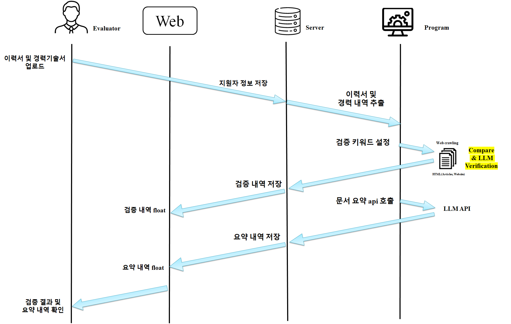
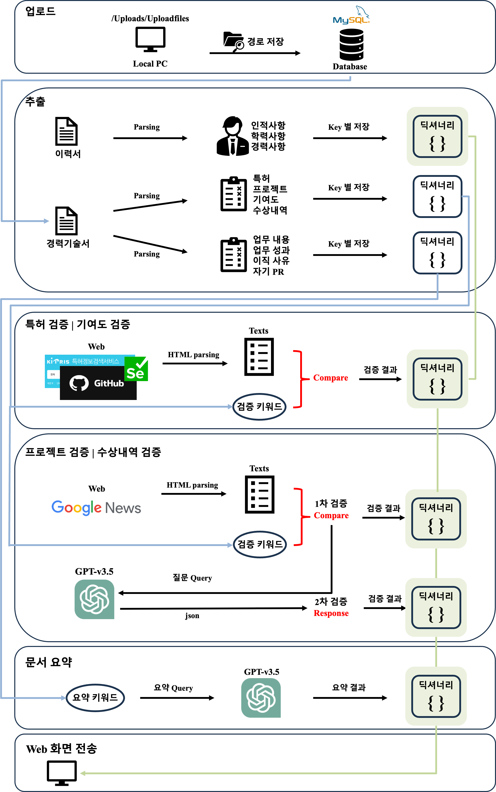
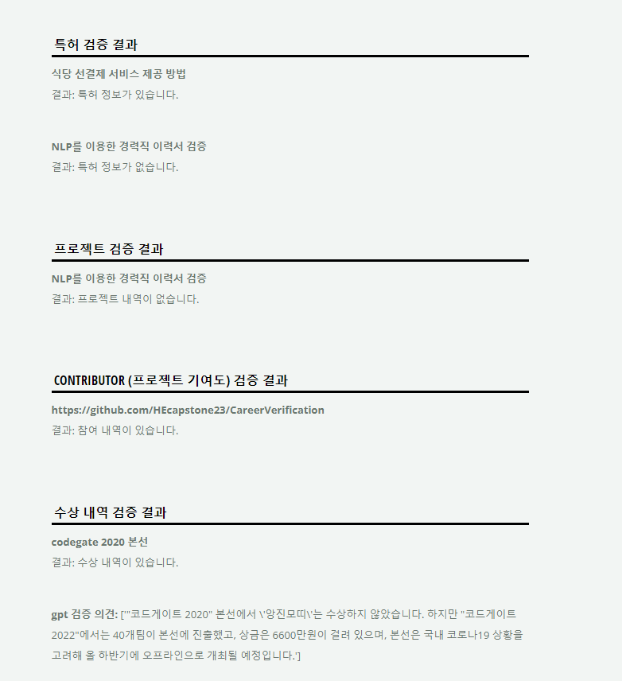

# CareerNium: NLP를 이용한 경력직 이력서 검증 서비스
## 2023-2024 한양대학교 ERICA 소프트웨어융합대학 산학캡스톤 프로젝트
***

### 팀명
하이니움 (HYnium)

### 구성원
팀장: 컴퓨터학부 윤성빈
팀원1: 컴퓨터학부 안도형
팀원2: 컴퓨터학부 한정우
팀원3: ICT융합학부 손민지

### 개요 및 목적
대기업 경력직 채용의 경우, 이력서, 경력기술서, 포트폴리오 3가지 서류를 제출한다. 심사위원은 해당 서류를 일일이 검토하여 확인하는데에 많은 시간과 노력을 쏟고, 경력직의 특성상 공모전, 수상내역, 프로젝트 등의 사실 여부 검증이 어렵다. 
특히, 신입사원과는 다르게 이전 직장에서 참여하거나 주도한 프로젝트의 경우, 기업 보안 상 자세한 내용을 검증하기 어려울 수 있다. 따라서, 이력서의 경우, 기술된 지원자의 정보를 파싱하여 자동으로 가져오고, 경력기술서의 경우, 기술된 지원자의 프로젝트, 공모전, 수상내역 등의 세부사항을 자동으로 가져와 웹 크롤링을 통해 검증할 수 있는 이력서 자동화 검증 프로그램을 구현한다. 추가로, 위 과정에서 추출된 정보를 바탕으로  모델을 활용해 요약 기능을 제공한다. 
이를 통해 경력직 채용 심사의 절차를 간소화하고 시간 및 비용 감소에 도움을 줄 수 있을 것으로 보인다.

### 구현 과정
Selenium, BeautifulSoup을 이용해 이력서, 경력기술서를 자동화 검증한다.
주요 기능은 다음과 같다.

1. 이력서 및 경력기술서 텍스트 파싱 및 정보 추출
2. 기술된 특허, 프로젝트, github 내 contributor, 수상내역 정보에 관한 키워드를 바탕으로 자동화 검증
3. GPT-v3.5 API를 활용한 경력기술서 핵심 정보 요약

**이력서 및 경력기술서 텍스트 파싱 및 정보 추출**은 Python의 tika 라이브러리와 정규표현식을 사용해 PDF 형식 문서에서 인적사항, 학력사항, 경력사항, 특허 사항, 프로젝트 사항 및 각 프로젝트 github repository, 수상 사항을 파싱해 추출한다. 텍스트는 다양한 형식이 존재하므로 최대한 맞춰 많은 형식을 보완할 수 있는 정규표현식을 강구한다.

**기술된 정보에 관한 키워드 기반 자동화 검증**은 웹 브라우저 자동화 오픈 소스인 Selenium과 웹크롤링 라이브러리 BeautifulSoup를 사용한다.

**특허**의 경우, 키프리스에서 키워드 검색 후 페이지 html 내 지원자명, 특허명, 기관명 키워드가 존재하는지 검증한다.

**프로젝트**의 경우, 구글 뉴스에서 정적 크롤링을 통해 가져온 html 내 지원자의 성명과 기술된 프로젝트 명, 기관명 키워드가 존재하는지 1차 검증하고, GPT API를 활용해 키워드가 담긴 질문 Query를 보내어 전달 받은 response로 2차 검증한다.

**contributor**의 경우, github에서 제공하는 API를 사용해 json 형태로 가져온 텍스트 내 지원자의 github ID가 존재하는지 검증한다.

**수상내역**의 경우, 프로젝트 검증과 마찬가지로 구글 뉴스에서 정적 크롤링을 통해 가져온 html 내 지원자의 팀명(성명)과 기술된 상훈명, 기관명 키워드가 존재하는지 1차 검증하고, GPT API를 활용해 키워드가 담긴 질문 Query를 보내어 전달 받은 response로 2차 검증한다.

**GPT v3.5 API를 활용한 경력기술서 핵심 요약**은 이직 사유, 자기 PR 등 경력기술서 내 파싱된 텍스트를 Query 질문으로 보내어 전달 받은 요약 텍스트를 사용자에게 보여주도록 한다.

### 구상도 (System Model)

### 구현 상세

### 구현 웹페이지

### 사용 스택
Python, Flask, MySQL, GCP(Google Cloud Platform), BeautifulSoup, Selenium, GPT-v3.5